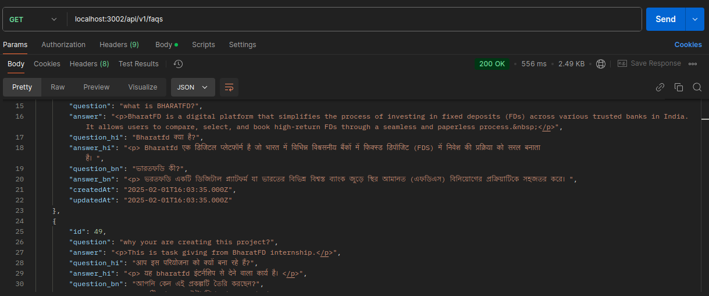
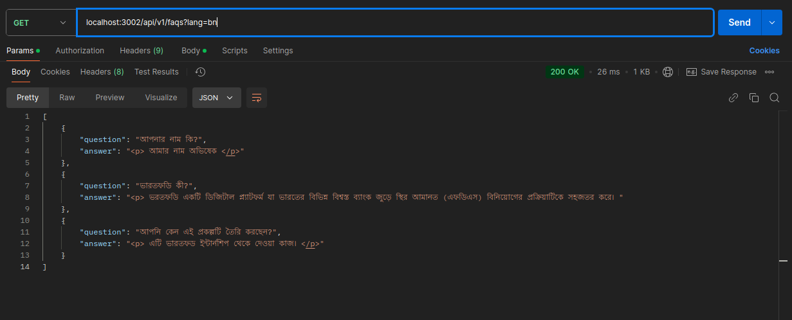
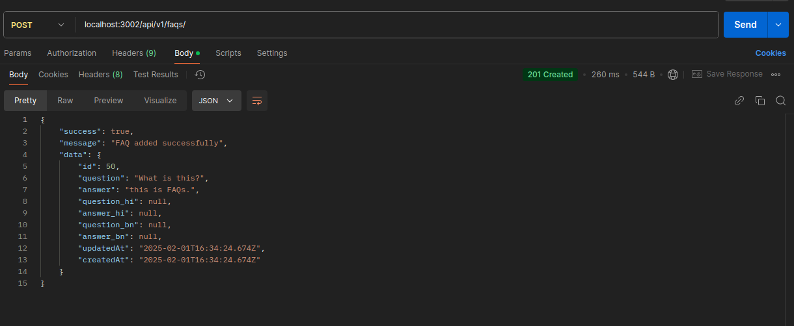
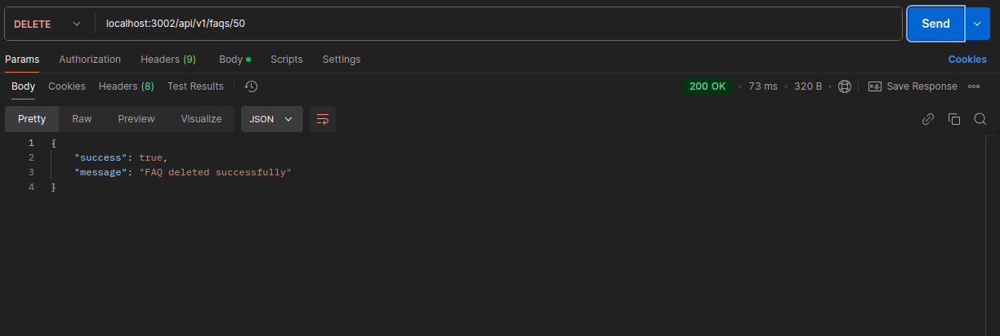
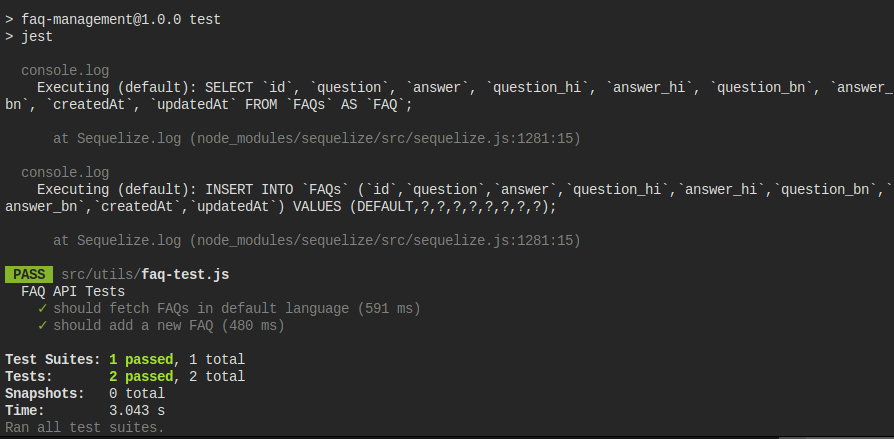
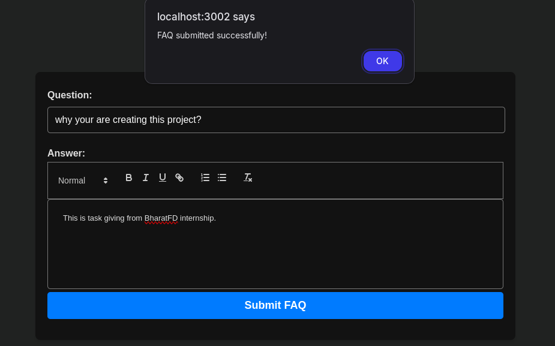
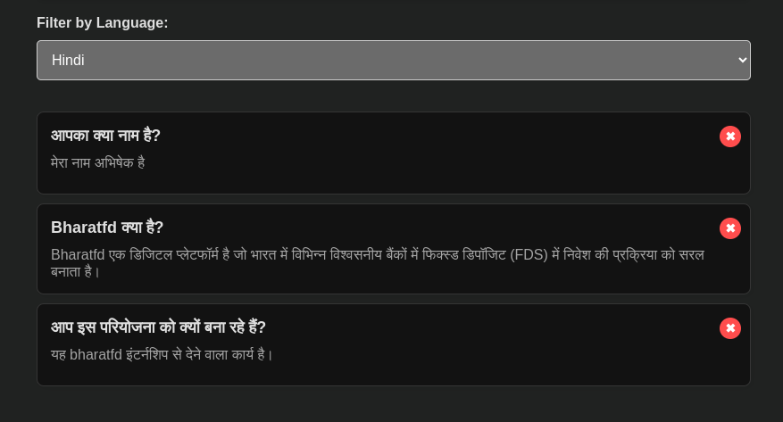
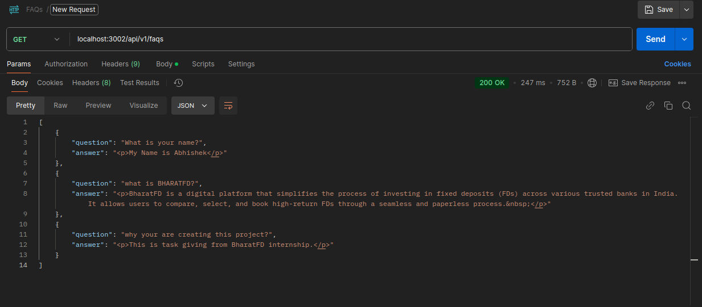

# FAQ Management System

This is a backend application for managing FAQs (Frequently Asked Questions). The application supports multiple languages, WYSIWYG formatting for answers, caching, and integrates with Google Translate for automatic translations.

## Features

- Create, retrieve, update, and delete FAQs.
- Support for multiple languages (translations handled via Google Translate API).
<!-- - Caching mechanism with Redis for faster responses. -->
- WYSIWYG support for formatting FAQ answers using Quill.js.
- REST API for interacting with FAQ data.
- Admin panel for managing FAQs.
- Filtering FAQs by language.
- Docker support for easy deployment.
- Unit testing with Jest and Supertest.
- Follows best practices for code quality and commit messages.

## Tech Stack

- **Node.js** - Backend JavaScript runtime.
- **Express** - Web framework for building RESTful APIs.
- **Sequelize** - ORM for interacting with the MySQL database.
- **MySQL** - Relational database to store FAQ data.
<!-- - **Redis** - Caching for translations to improve performance. -->
- **Google Translate API** - For automatic translation of FAQ content.
- **Quill.js** - WYSIWYG editor for rich text formatting.
- **AdminBro** - Admin panel for managing FAQs.
- **dotenv** - Manage environment variables.
- **Jest & Supertest** - For writing and running tests.

## Installation

### Prerequisites

- Node.js and npm installed
- MySQL database running
<!-- - Redis server installed and running -->
- Docker (optional, if using Docker)

### 1️⃣ Clone the Repository

```
git clone https://github.com/znabhi/FAQsManagement.git
cd faq-management
```

### 2️⃣ Install Dependencies

```
npm install
```

### 3️⃣ Set Up Environment Variables

```
PORT=3002
```

### 4️⃣ Set Up the Database

```
npx sequelize db:create
npx sequelize db:migrate
```

### 5️⃣ Start the Server

```
npm start
```

## API Endpoints

### 🚀 Get All FAQs

```
GET localhost:3002/api/v1/faqs/
```



### 🌍 Get FAQs in a Specific Language

```
GET localhost:3002/api/v1/faqs/?lang=bn
```



### ➕ Add a New FAQ

```
POST localhost:3002/api/v1/faqs/
-H "Content-Type: application/json" \
-d '{"question": "What is Node.js?", "answer": "It is a runtime environment."}'
```



### 🔄 Delete an FAQ

```
DELETE localhost:3002/api/v1/faqs/{id}
```



### Running Tests

```
npm test
```



## Frontend Integration

The frontend includes:

- **Quill.js** for WYSIWYG editor support.
- **Filtering FAQs by language** dropdown.
- **Delete button styling** with modern design.
- **Admin panel** for easy management.

### 🖥️ Frontend Setup

1. Open `index.html` in a browser.
2. Ensure `editor.js` and `styles.css` are linked correctly.
3. Adjust API URLs in `editor.js` if needed.
4. Enjoy managing FAQs!

### ✍️ WYSIWYG Editor Integration



### Editor Integration Filter



### 📌 API Response



### 📌 API Example: Get FAQs in Bengali


## Contributing

Feel free to fork this repository, submit issues, and create pull requests. Contributions are always welcome!

If you encounter any issues or have questions, please open an issue in the repository, and we'll be happy to assist.

## License

This project is licensed under the MIT License - see the [LICENSE](LICENSE) file for details.
